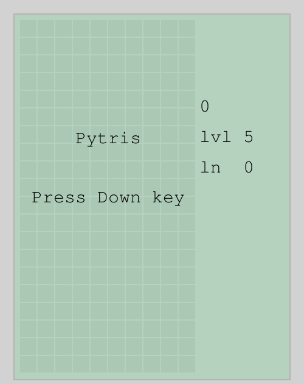

# pytris
Tetris clone in pygame

Damn this game is difficult for novice like me to implement. I wrote the code like a crazy. Hacking patching and seems right solutions are in the code. Sorry for that.
### How to play
- First set `conf.set_screen` in `if __name__ == "__main__"` section according to your need.
- Use left or right arrow key to move. up arrow key to rotate clockwise. down arrow key to speed up the fall.
- use `a` key to rotate counter clockwise and `s` key to rotate clockwise.
- `c` key to change color
- press down arrow to start a game again.

### TODO
- Add comments
- Clean up and optimize the code
- Implement kick system for rotation (now this feature is missing)
- add better mechanism to change theme (now pressing 'c' key change the color)
- add better mechanism to change level. (currently need to change value of `conf.starting_level`before starting the game)
- add sound.
