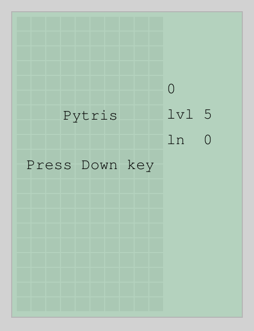

# pytris
Tetris clone in pygame

### How to play
- First set `conf.set_screen` in `if __name__ == "__main__"` section according to your need. You can change many things here. See `Config` class.
- `Down` arrow key to start.
- Change level before starting a game by using bracket. `[` to decrease and `]` to increase level. 
- `Left` or `Right` arrow key to move. 
- `Up` arrow key to rotate clockwise.
- `Down` arrow key to speed up the fall.
- `a` key to rotate counter clockwise
- `s` key to rotate clockwise.
- `c` key to change color.
- `r` to restart game.

Level increase after every 10 lines cleanup. Change this in `Config`. Or Change `level_up_by_score` to `True` to Level up after every 10000 score.

### TODO
- ~Add comments~
- ~Clean up and optimize the code~ Partially done.
- **Implement kick system for rotation (now this feature is missing)** PR is welcome. Get Idea from here https://tetris.wiki/Super_Rotation_System
- Add an UI system to configure config in game.
- Add better mechanism to change theme.
- Add better mechanism to change level.
- add sound.
